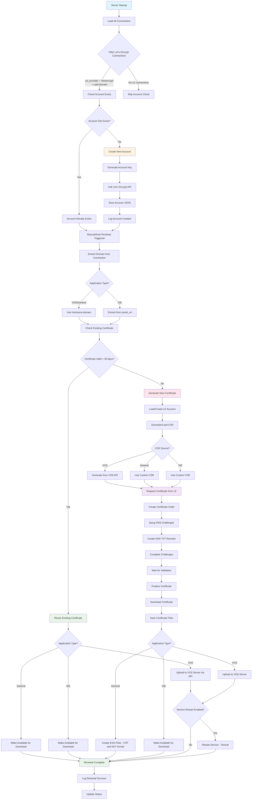
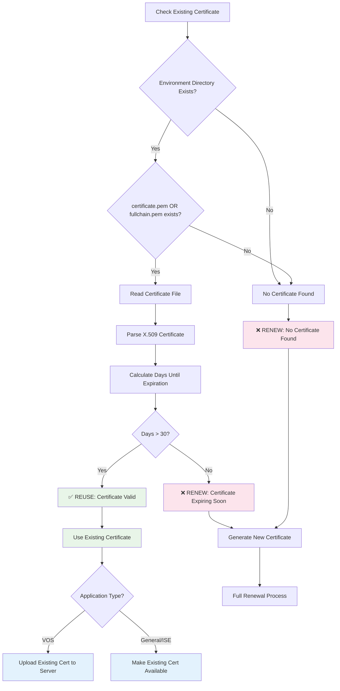

# Certificate Management Documentation

This document explains how the VOS SSH Dashboard handles Let's Encrypt certificate management, including the directory structure, renewal logic, and certificate reuse mechanisms.

## Account File Organization

### Directory Structure

The system uses an organized directory structure for Let's Encrypt accounts and certificates:

```
/accounts/
├── domain.example.com/
│   ├── staging/
│   │   ├── letsencrypt.json                    # Let's Encrypt account file
│   │   ├── certificate.pem                     # Domain certificate (leaf) in PEM format
│   │   ├── private_key.pem                     # Private key in PEM format
│   │   ├── certificate.csr                     # Certificate Signing Request
│   │   ├── fullchain.pem                       # Complete certificate chain
│   │   ├── chain.pem                          # Intermediate + Root certificates only
│   │   ├── intermediate.crt                    # Intermediate certificate (R10/Fake LE Intermediate)
│   │   ├── root.crt                           # Root certificate (ISRG Root X1/Fake LE Root)
│   │   ├── ca-bundle.crt                       # All CA certificates combined
│   │   ├── domain.example.com.crt              # Domain certificate in CRT format
│   │   └── domain.example.com.key              # Private key in KEY format
│   ├── prod/
│   │   └── (same files for production environment)
│   └── renewal.log                             # Renewal history log (shared)
```

### Environment Separation

- **Staging**: Used when `LETSENCRYPT_STAGING=true` (default)
- **Production**: Used when `LETSENCRYPT_STAGING=false`
- Each environment maintains completely separate:
  - Let's Encrypt accounts
  - Certificates
  - Private keys
  - CSRs

### Certificate Chain Files Explained

The system extracts and saves certificates in multiple formats for different application needs:

#### Core Certificate Files

- **`certificate.pem`** - Domain certificate only (leaf certificate)
- **`private_key.pem`** - Private key for the domain certificate  
- **`fullchain.pem`** - Complete certificate chain (leaf + intermediate + root)
- **`chain.pem`** - CA certificates only (intermediate + root, no leaf)

#### Individual CA Certificates

- **`intermediate.crt`** - Intermediate certificate only
  - **Production**: R10 or R11 Let's Encrypt intermediate certificate
  - **Staging**: (STAGING) Fake LE Intermediate X1
- **`root.crt`** - Root certificate only
  - **Production**: ISRG Root X1
  - **Staging**: (STAGING) Fake LE Root X1
- **`ca-bundle.crt`** - All CA certificates combined (same as chain.pem)

#### Application-Friendly Formats

- **`domain.example.com.crt`** - Domain certificate in .crt format
- **`domain.example.com.key`** - Private key in .key format

### Certificate Usage by Application Type

#### Cisco VOS (CUCM, CUC, CER)

- **Leaf Certificate**: Upload `certificate.pem` or `domain.crt` via certificate upload API
- **CA Certificates**: Upload `intermediate.crt` and `root.crt` separately via CA certificate API
- **Private Key**: Generated and stored on VOS system (not available for download)

#### ISE Applications

- **Leaf Certificate**: Install `certificate.pem` or `domain.crt`
- **Intermediate**: Install `intermediate.crt` (R10 for production, Fake LE Intermediate for staging)
- **Root**: Install `root.crt` (ISRG Root X1 for production, Fake LE Root for staging)
- **Private Key**: Use `private_key.pem` or `domain.key` (only for General applications with custom CSR)

#### General Applications

- **Complete Chain**: Use `fullchain.pem` for most web servers (nginx, Apache)
- **Separate Files**: Use `certificate.pem` + `chain.pem` for applications that need them separate
- **ESXi Format**: Use `domain.crt` + `domain.key` for VMware ESXi import

## Application Type Support

### VOS Applications (CUCM, CUC, CER) - Detailed

- Use `hostname.domain` format for FQDN construction
- Example: `cucm01-pub.automate.builders`
- Certificates are uploaded via VOS API
- Support automatic service restart (Tomcat)

### ISE Applications - Detailed

- Use `portal_url` field for domain extraction
- Supports full URLs: `https://ise.example.com:8443` → `ise.example.com`
- Supports wildcard domains: `*.example.com` → `example.com`
- Supports domain-only format: `ise.example.com`

### General Applications - Detailed

- Use `hostname.domain` format for FQDN construction
- Certificates made available for manual download
- Support custom CSR upload
- Generate .crt/.key files for ESXi compatibility

## Certificate Renewal Logic

### Process Flow Diagram



### Certificate Reuse Decision Tree



### Automatic Account Creation

**When**: Server startup

**What**: Creates Let's Encrypt accounts for ALL connections with:

- `ssl_provider === 'letsencrypt'`
- Valid domain configuration (hostname/domain or portal_url)
- **Note**: Account creation happens regardless of auto_renew setting

### Certificate Reuse Logic

The system implements intelligent certificate reuse to avoid unnecessary renewals:

#### 30-Day Validation Rule

- **Check**: Is existing certificate valid for more than 30 days?
- **If YES**: Reuse existing certificate
- **If NO**: Generate new certificate

#### What Happens When Certificate is Reused

**✅ What It DOES:**

1. Uses the existing certificate instead of generating a new one
2. **For VOS applications**: Uploads existing certificate to server via API
3. **For General applications**: Makes existing certificate available for download
4. Handles service restart if enabled (e.g., restarts Tomcat service)
5. Marks renewal as completed successfully

**❌ What It SKIPS:**

- CSR Generation: No new Certificate Signing Request created
- Let's Encrypt API calls: No new certificate request to Let's Encrypt
- DNS challenges: No DNS TXT records created/validated
- Certificate generation: No new certificate issued
- Account creation: No new Let's Encrypt account needed

#### Process Flow

```text
1. Check existing certificate validity (30+ days remaining?)
   ├─ YES → Use existing cert → Upload to server → Restart service → DONE ✅
   └─ NO  → Generate CSR → Request from Let's Encrypt → Upload → DONE ✅
```

#### Example Scenario
If you run a certificate renewal on January 1st, and the existing certificate expires on March 1st (60 days away), the system will:

1. ✅ Find the existing certificate in `accounts/domain/staging/certificate.pem`
2. ✅ Calculate it expires in 60 days (more than 30)
3. ✅ Upload that same certificate to your CUCM server
4. ✅ Restart Tomcat service (if enabled)
5. ✅ Mark renewal complete - no new certificate generated!

### Benefits of Certificate Reuse

- **Efficiency**: No unnecessary API calls to Let's Encrypt
- **Speed**: Faster renewal process
- **Rate Limits**: Conserves Let's Encrypt rate limits
- **Reliability**: Uses proven valid certificates
- **Consistency**: Still gets certificate deployed to server

### Auto-Renewal Timing

**Automatic renewals** are triggered when certificates expire within **7 days**.

**Manual renewals** will reuse certificates valid for more than **30 days**.

## File Migration

### Automatic Migration Process

When upgrading from the old flat file structure, the system automatically migrates:

**From (old)**: `domain_provider_env.json`
**To (new)**: `domain/env/provider.json`

Example:

- `cucm01-pub.automate.builders_letsencrypt_staging.json`
- Becomes: `cucm01-pub.automate.builders/staging/letsencrypt.json`

### Migration Features

- **One-time operation**: Creates `.migration-complete` marker file
- **Safe migration**: Checks for existing files before moving
- **Automatic cleanup**: Migration script removes itself after completion
- **Error handling**: Skips invalid files, continues with valid ones

## Environment Configuration

### Required Environment Variables

```bash
# Let's Encrypt Environment
LETSENCRYPT_STAGING=true          # Use staging (true) or production (false)
ACCOUNTS_DIR=./accounts           # Directory for account storage
```

### Settings Database Requirements

For each connection using Let's Encrypt:

- `LETSENCRYPT_EMAIL`: Email for Let's Encrypt account registration

## Security Considerations

### File Permissions

- Account files contain private keys and should be protected
- Directory structure isolates environments
- No sensitive data in log files

### Environment Isolation

- Staging and production completely separated
- Switching environments requires new account creation
- Certificates are environment-specific

## Troubleshooting

### Common Issues

1. **"null.null" entries**: Caused by connections with missing hostname/domain
   - Fix: Ensure all connections have valid hostname/domain or portal_url

2. **Account creation hanging**: Usually network/DNS issues
   - Check: Internet connectivity to Let's Encrypt servers
   - Verify: DNS provider configuration

3. **Certificate validation failing**: Path issues with new directory structure
   - Check: Files exist in correct environment directory
   - Verify: Environment variable settings

### Log Locations

- **Application logs**: Console output during server startup
- **Renewal logs**: `accounts/domain/renewal.log`
- **Account verification**: Server startup logs

## API Endpoints

### Certificate Information

- `GET /api/certificate/:id` - Get certificate info for connection
- Uses appropriate domain extraction based on application type

### Account Management

- Account files managed automatically
- No direct API endpoints for account manipulation

## Maintenance

### Regular Tasks

- Monitor renewal logs for failures
- Check disk space in accounts directory
- Verify environment settings before production use

### Backup Recommendations

- Backup entire `/accounts` directory
- Include both staging and prod subdirectories
- Backup before environment switches

---

*Last Updated: July 12, 2025*
*Documentation covers certificate management system v2.0 with environment-based directory structure*
