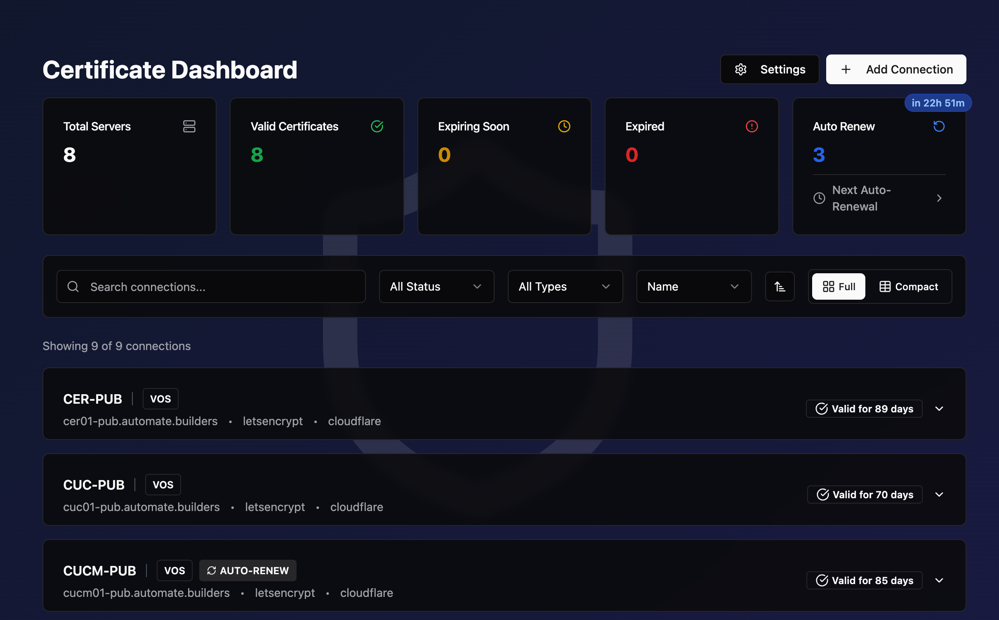

# netSSL

A comprehensive web-based dashboard for SSL certificate management across enterprise infrastructures. Built to work with both general applications and enterprise systems with API support, including Cisco Voice over Secure (VOS) platforms (CUCM, CUC, CER) and Cisco Identity Services Engine (ISE) through their OpenAPI interfaces. Features automated certificate installation, renewal, and service restart capabilities.



## Features

- **Multi-Platform Support**: Manage SSL certificates across multiple platforms from a single interface
  - **VOS Platforms**: Cisco CUCM, CUC, CER with SSH-based service restart
  - **ISE Platforms**: Cisco ISE with OpenAPI integration for automated operations
  - **General Applications**: Support for any system requiring certificate management
- **Certificate Operations**: 
  - Generate Certificate Signing Requests (CSRs)
  - Automated certificate upload and installation via API
  - Real-time certificate monitoring and expiration tracking
  - Support for multi-SAN and wildcard certificates
- **Automated Operations**: 
  - Let's Encrypt integration with ACME protocol
  - Automatic certificate renewal and installation
  - Service restart automation (SSH for VOS, API for ISE)
  - DNS challenge automation with multiple provider support
- **DNS Provider Support**: Built-in support for Cloudflare, Azure DNS, DigitalOcean, Google Cloud DNS, Route53, and more
- **Enterprise Features**: 
  - Real-time operation logging and monitoring
  - WebSocket-based live updates during operations
  - Secure credential storage with bcrypt hashing
  - Role-based connection management with enable/disable controls
- **Modern UI**: Clean, responsive interface built with React and Tailwind CSS

## Tech Stack

- **Frontend**: React 19, TypeScript, Vite, Tailwind CSS, Radix UI
- **Backend**: Express.js, TypeScript, SQLite
- **Security**: Input validation, bcrypt password hashing
- **Testing**: Jest (backend), Vitest (frontend)
- **Deployment**: Single Docker container with nginx and Node.js

## Prerequisites

- Docker and Docker Compose (recommended)
- Or Node.js 18+ and npm (for development)
- Access to target systems with administrative credentials

## Installation

### Option 1: Quick Docker Deployment (Easiest - Recommended)

Download and run with a single command using curl or wget:

**With curl:**
```bash
curl -O https://raw.githubusercontent.com/sieteunoseis/netSSL/master/docker-compose.yml
docker-compose up -d
```

**With wget:**
```bash
wget https://raw.githubusercontent.com/sieteunoseis/netSSL/master/docker-compose.yml
docker-compose up -d
```

The application will be available at http://localhost:3000

**To customize configuration:**
1. Edit the `docker-compose.yml` file to update branding and DNS provider credentials
2. For production, set `LETSENCRYPT_STAGING=false`
3. Restart: `docker-compose restart`

### Option 2: Docker Build from Source

1. Clone the repository:
```bash
git clone https://github.com/sieteunoseis/netSSL.git
cd netSSL
```

2. Configure environment variables:
```bash
cp .env.example .env
# Edit .env with your configuration
```

3. Build and start with Docker Compose:
```bash
docker-compose up --build
```

The application will be available at http://localhost:3000

### Option 3: Development Installation

1. Clone the repository:
```bash
git clone https://github.com/sieteunoseis/netSSL.git
cd netSSL
```

2. Install dependencies:
```bash
npm run install-all
```

3. Configure environment variables:
```bash
cp .env.example .env
# Edit .env with your configuration
```

4. Start the development server:
```bash
npm run dev
```

The application will be available at:
- Frontend: http://localhost:5173
- Backend API: http://localhost:3000

## Configuration

### Database Setup

The application uses SQLite with dynamic table creation. Configure your VOS server fields in `frontend/public/dbSetup.json`.

### Environment Variables

Key environment variables:
- `LETSENCRYPT_STAGING`: Use Let's Encrypt staging environment (default: true)
- DNS provider credentials (varies by provider)
- Branding customization (VITE_BRANDING_URL, VITE_BRANDING_NAME)

Note: Database table columns are hardcoded in the application for consistency and reliability.

### Let's Encrypt Configuration

For production certificates, set `LETSENCRYPT_STAGING=false`. Account information is stored separately for staging and production environments.

## Usage

1. **Add Systems**: Navigate to the dashboard and add your target systems:
   - **VOS Platforms**: CUCM, CUC, CER with SSH credentials
   - **ISE Platforms**: ISE nodes with OpenAPI credentials  
   - **General Applications**: Any system requiring certificate management
2. **Generate CSR**: Select a system and generate Certificate Signing Requests
3. **Automated Operations**: 
   - Use Let's Encrypt for automated certificate generation and installation
   - Configure DNS providers for automatic challenge validation
   - Enable auto-renewal for hands-off certificate management
4. **Manual Operations**: Upload and install certificates manually when needed
5. **Monitor & Manage**: 
   - View real-time certificate status and expiration dates
   - Monitor operations through live logging
   - Enable/disable systems for maintenance

## Development

### Testing
```bash
# Backend tests
cd backend && npm test

# Frontend tests
cd frontend && npm test
```

### Building
```bash
# Docker build
npm run build

# Frontend production build
cd frontend && npm run build

# Backend TypeScript compilation
cd backend && npm run build
```

## Docker Deployment Details

### Architecture

The application is packaged as a single Docker container containing both frontend (nginx) and backend (Node.js) services:

- **nginx** serves the React frontend and proxies API requests
- **Node.js backend** handles API requests on internal port 5000
- **PM2** manages both processes with automatic restart
- **Persistent volumes** for database and certificate storage

### Advanced Docker Usage

```bash
# Build and run directly with Docker
docker build -t netssl .
docker run -p 3000:80 \
  -v ./backend/db:/app/db \
  -v ./backend/accounts:/app/accounts \
  --env-file .env \
  netssl
```

### Production Environment Variables

Create a `.env` file with your configuration:
```bash
# Required environment variables
VITE_BRANDING_URL=https://your-domain.com
VITE_BRANDING_NAME=Your Company
PORT=5000
NODE_ENV=production

# Let's Encrypt settings
LETSENCRYPT_STAGING=false

# DNS provider credentials (as needed)
CLOUDFLARE_TOKEN=your-token
AZURE_CLIENT_ID=your-client-id
AZURE_CLIENT_SECRET=your-secret
AZURE_TENANT_ID=your-tenant-id
```

## Security Considerations

- All passwords are hashed using bcrypt
- Input validation on both client and server
- HTTPS recommended for production deployment
- Regular security updates for dependencies

## License

MIT License - see [LICENSE](LICENSE) file for details

## Contributing

[Your Contributing Guidelines]