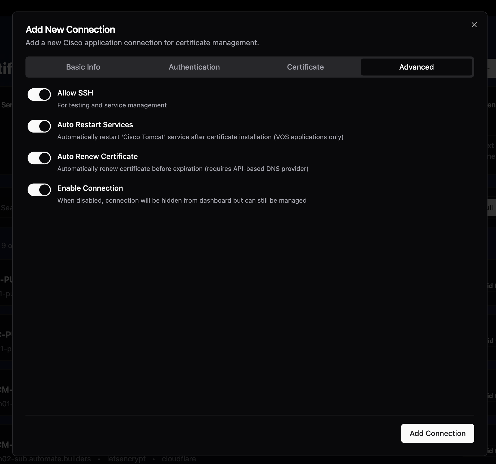
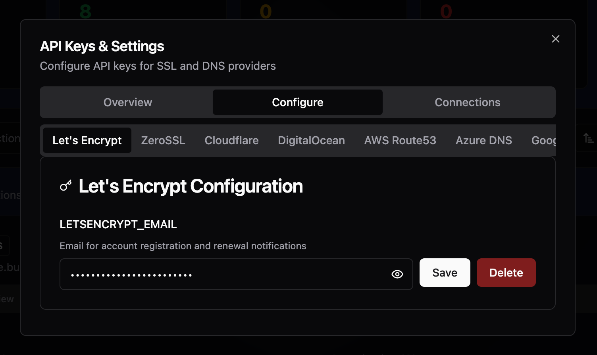
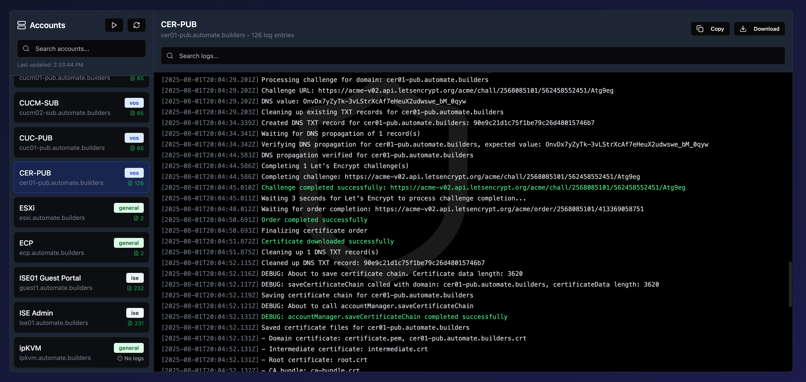
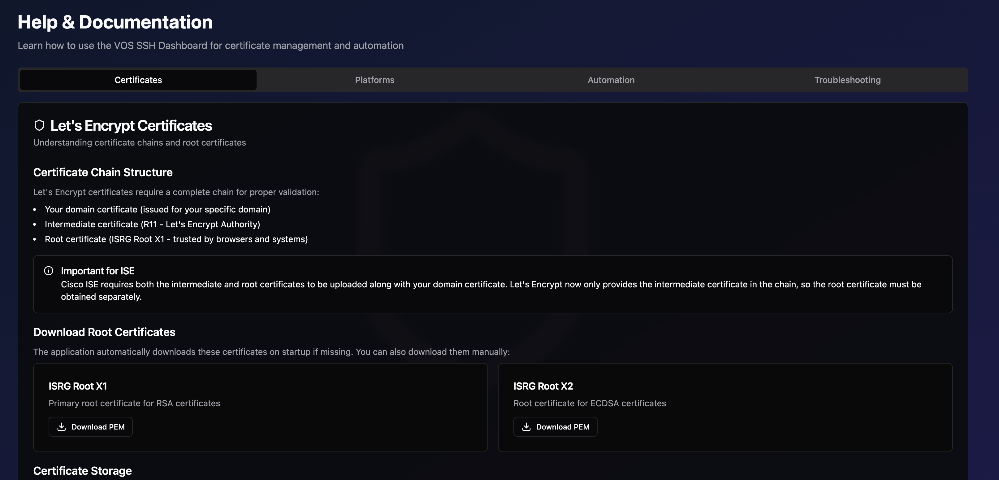

# netSSL Screenshots

This directory contains screenshots of the netSSL application showcasing its key features and interface.

## Screenshots

### Dashboard Overview

The main dashboard provides a comprehensive view of all managed systems and their SSL certificate status:
- Total connection count with status breakdown
- Valid certificates (green badges)
- Certificates expiring soon (yellow warning)
- Expired certificates (red alert)
- Auto-renewal status indicators
- Quick actions for certificate management
- Card and table view modes

### Certificate Details

Detailed certificate information view showing:
- Full certificate chain visualization
- Subject and issuer details
- Validity period with exact dates
- Certificate fingerprints (SHA1, SHA256)
- Serial number
- Subject Alternative Names (SANs)
- Real-time certificate status
- Certificate performance metrics (DNS, TCP, TLS timing)

### Add Connection Modal

#### Basic Information (Page 1)

Initial connection setup with:
- Connection name and identification
- Application type selection (VOS/ISE/General)
- Server hostname and port configuration
- Authentication credentials
- Platform-specific options

#### Advanced Settings (Page 2)

Advanced configuration options:
- Domain and SSL provider settings
- DNS provider selection and configuration
- Auto-renewal settings
- API endpoint customization
- Service restart options
- Additional platform-specific settings

### API Settings

Configuration interface for SSL and DNS providers:
- Let's Encrypt integration settings
- Multiple DNS provider support (Cloudflare, Azure, DigitalOcean, Google Cloud, Route53)
- Secure credential management
- Easy provider switching
- API key management
- Provider-specific configuration options

### Logs View

Comprehensive logging interface featuring:
- Real-time operation logs
- Color-coded log entries (success, warning, error)
- Account/connection filtering
- Log search functionality
- Auto-refresh capabilities
- Export and copy options
- Detailed timestamp tracking
- Certificate renewal history

### Help Documentation

Extensive help and documentation section with:
- Certificate management guides
- Platform-specific instructions (VOS, ISE, General)
- Let's Encrypt integration details
- DNS provider setup guides
- Automation configuration
- Troubleshooting tips
- Best practices and recommendations