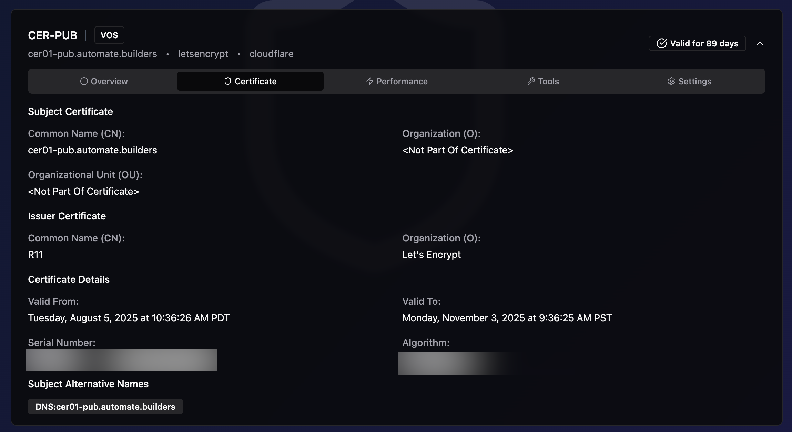

# Cisco SSL Dashboard Screenshots

This directory contains screenshots of the Cisco SSL Dashboard application showcasing its key features and interface.

## Screenshots

### Dashboard Overview

The main dashboard provides a comprehensive view of all managed Cisco VOS servers and their SSL certificate status:
- Total server count
- Valid certificates (green)
- Certificates expiring soon (yellow)
- Expired certificates (red)
- Quick actions for certificate management

### Certificate Details

Detailed certificate information view showing:
- Subject and issuer details
- Validity period with exact dates
- Certificate fingerprints (SHA1, SHA256)
- Serial number
- Subject Alternative Names (SANs)
- Real-time certificate status

### API Settings

Configuration interface for SSL and DNS providers:
- Let's Encrypt integration settings
- Multiple DNS provider support (Cloudflare, Azure, DigitalOcean, Google Cloud, Route53)
- Secure credential management
- Easy provider switching

### Add Connection Modal

User-friendly modal for adding new Cisco VOS server connections:
- Application type selection (CUCM/CER/CUC)
- Server hostname and credentials
- Domain configuration
- SSL provider selection
- DNS provider configuration
- Scrollable interface for easy access to all fields